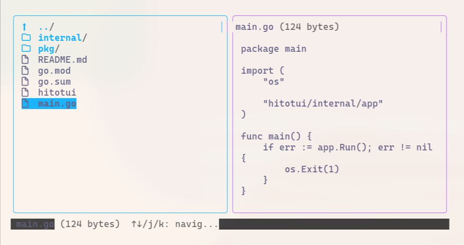
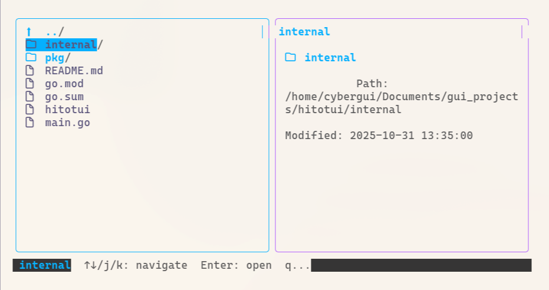

## hitotui

<div align="center">

A beautiful, colorful terminal file manager inspired by [yazi](https://github.com/sxyazi/yazi), built with Go and [Bubbletea](https://github.com/charmbracelet/bubbletea).





</div>

## Features

- **Dual-pane interface**: Navigate files on the left, preview content on the right
- **Vim-style navigation**: Use arrow keys or `j`/`k` to move up and down
- **File preview**: View text files, directory information, and file metadata
- **Beautiful UI**: Colorful, modern terminal interface with responsive design
- **Hidden files toggle**: Press `.` to show/hide hidden files
- **Keyboard shortcuts**: Intuitive key bindings for efficient file management

## Installation

### From Source

```bash
git clone https://github.com/guicybercode/hitotui
cd hitotui
go build -o hitotui
./hitotui
```

### Prerequisites

- Go 1.21 or later
- A terminal emulator with color support

## Usage

Launch hitotui from your terminal:

```bash
./hitotui
```

Or navigate to a specific directory:

```bash
./hitotui /path/to/directory
```

## Keyboard Shortcuts

| Key | Action |
|-----|--------|
| `↑` / `k` | Move selection up |
| `↓` / `j` | Move selection down |
| `Enter` | Open directory or file |
| `Backspace` / `h` | Go to parent directory |
| `.` | Toggle hidden files |
| `q` / `Ctrl+C` | Quit |

## Architecture

```
hitotui/
├── main.go                 # Application entry point
├── internal/
│   ├── app/                # Main Bubbletea model
│   ├── ui/                 # UI components (layout, file list, preview)
│   ├── fs/                 # File system operations
│   └── actions/            # File operations (copy, move, delete)
└── pkg/
    └── config/             # Configuration management
```

## Technologies

- **Bubbletea**: Terminal UI framework for Go
- **Lipgloss**: Styling and layout engine
- **Go standard library**: File system operations

## Development

### Building

```bash
go build -o hitotui
```

### Running

```bash
go run main.go
```

## Contributing

Contributions are welcome! Feel free to open issues or submit pull requests.

## License

MIT License - see LICENSE file for details.

## Author

Created by [Guilherme (@guicybercode)](https://github.com/guicybercode)

Connect with me on [LinkedIn](https://www.linkedin.com/in/guilherme-monteiro-3653b51a7)

---

**하나님은 나의 빛이요, 나의 구원이시니 내가 누구를 두려워하랴.**
